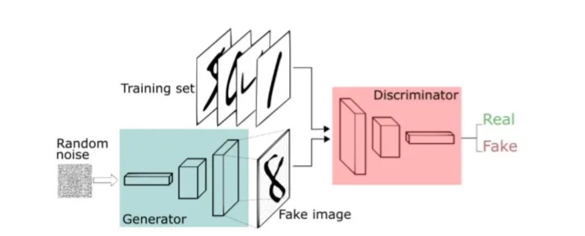

# Digital-Forensics Project

The project was aimed at training a Generative Adversarial Network following the architecture below.
## GAN architecture

## Methodology
* In this project, I used the [Fashion MINT dataset](https://www.kaggle.com/datasets/zalando-research/fashionmnist) in trainning the GAN network.
* The netwotk entailed of mainly two parts, the generator and discriminator. 
* With random noise fed into the generator, fake fashion resembling images where generated. These where then fed into the discriminator which categorised them as fake or real, based on the [test set data](https://www.kaggle.com/datasets/zalando-research/fashionmnist?select=fashion-mnist_test.csv) that was given to the discriminator.
* When the fake images where rejected by the discriminator, the generator learned that it needs to improve in making better images that resemble the real fashion images.

So the generator was trained on becoming better to fool the discriminator and the discriminator trained on becoming better in categorising fake and real fashion data.

The [algorithim](digital_forensics_project.py) can be run in Colab with GPU enabled or as a Jupyter notebook.

